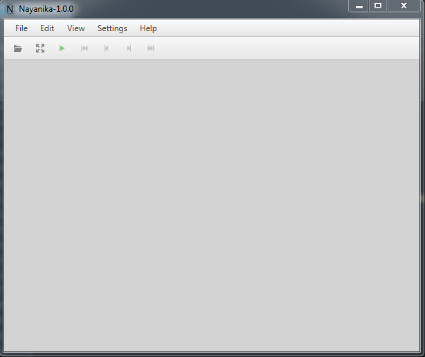

# Nayanika

Nayanika is a picture viewer application.



## Building Nayanika

In case you want to fork and build your local version of Nayanika.

### Prerequisites

- A recent version of JDK 17 (The version provided by [Adoptium](https://adoptium.net/) is an excellent choice).
- Apache Maven 3.8.1.

### How to run Nayanika

Before starting the app, all dependencies must be installed.

```bash
mvn install
```

The Nayanika can be started with Maven.

```bash
mvn exec:exec
```

### How to build Nayanika installer

Build the Nayanika installer based on host operating system.

```bash
mvn install -Pinstaller
```

This will build Nayanika at `target/installer` folder.

## Contributing

Help is welcome.
For major changes, please send an email first to discuss what you would like to change.

Please make sure to update tests as appropriate.

## Support

Any donations to support the project are accepted via.

- [Patreon](https://www.patreon.com/swardana)
- [Paypal](https://www.paypal.me/sukmawardana/10)

## License

[GNU General Public License, version 3 or later](COPYING)

## Additional Resources

- `#nayanika` IRC channel on `irc.libera.chat`.

## Special Thanks To


[JetBrains](https://jb.gg/OpenSource) supports open source project with its products and makes professional
software development a more productive and enjoyable experience.

Many thanks to [JetBrains](https://jb.gg/OpenSource) for sponsoring our Open Source projects with a license.


YourKit supports open source projects with innovative and intelligent tools for monitoring and profiling Java and .NET applications.
YourKit is the creator of [YourKit Java Profiler](https://www.yourkit.com/java/profiler/),
[YourKit .NET Profiler](https://www.yourkit.com/.net/profiler/),
and [YourKit YouMonitor](https://www.yourkit.com/youmonitor/).

Many thanks to Yourkit for sponsoring our Open Source projects with a license.